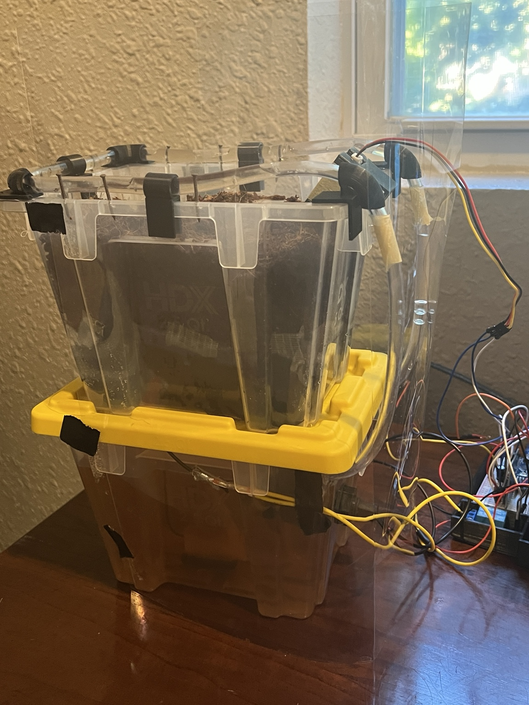
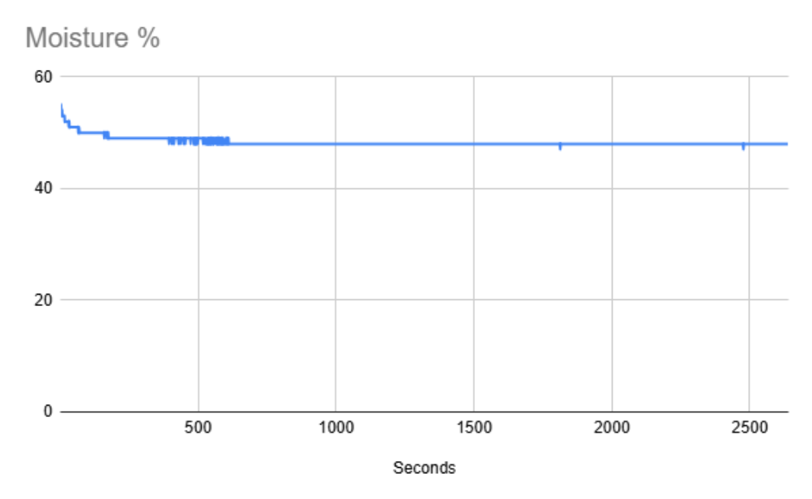
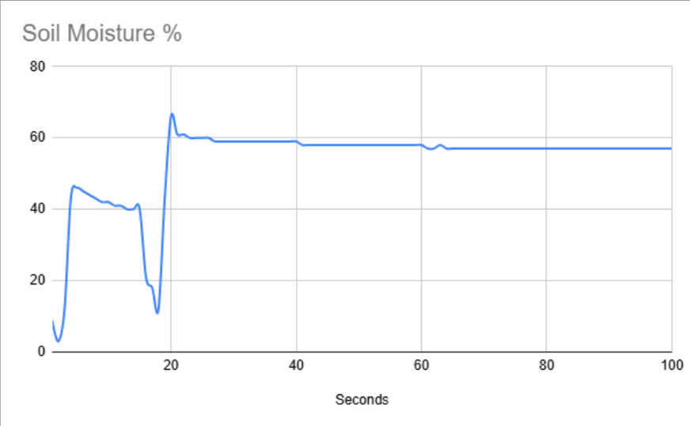
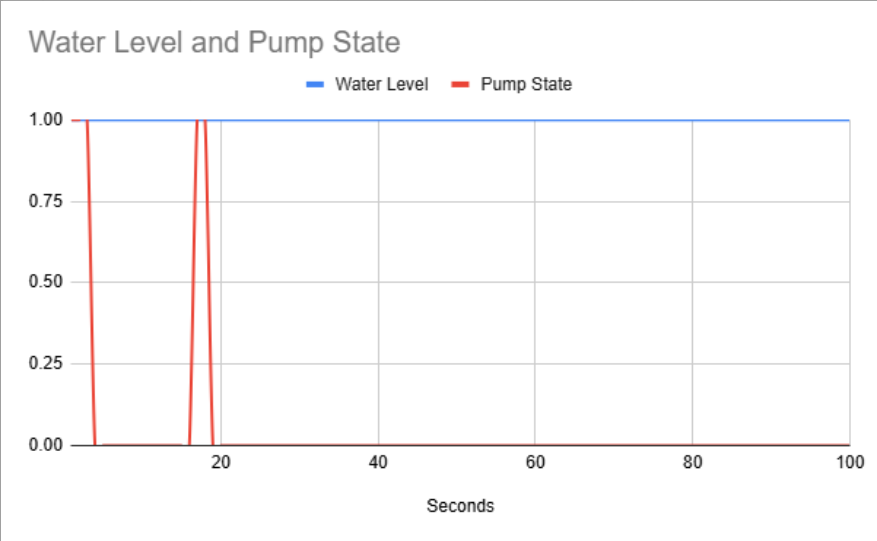

# Project-Verdant - README


## Project Verdant


### Automated Plant Monitoring \& Watering System


#### Giving plants the perfect start.





### **Overview**


Project Verdant is an automated plant monitoring and watering system designed to reduce the need for manual plant care. The system continuously monitors soil moisture and reservoir water level, automatically activates a pump when the growing medium becomes too dry, and records system data to a MicroSD card for later analysis.


The project combines embedded software, electronics, CAD, 3D printing, and iterative physical testing into a single autonomous system.


### **Key Features**


\- Automatic soil moisture monitoring

\- Automatic watering based on configurable moisture thresholds

\- Reservoir water-level monitoring

\- MicroSD data logging

\- Pump control through a relay

\- Custom 3D-printed components

\- Distributed water delivery

\- Splash protection for electronics

\- LED status indication for data logging

\- Designed for extended unattended operation


### **How It Works**


The system continuously monitors the growing medium using a capacitive soil moisture sensor. When the measured moisture falls below the configured threshold, the Arduino Nano activates the water pump through a relay.


Water is distributed through multiple openings in the watering tubing to reduce concentrated water flow and provide more consistent coverage. A horizontal float switch monitors the reservoir water level.


Sensor readings and system states are recorded to a MicroSD card, allowing the system's behavior to be analyzed after testing.


```
                 ┌───────────────────┐
                 │ Soil Moisture      │
                 │ Sensor             │
                 └─────────┬─────────┘
                           │
                           ▼
┌───────────────┐    ┌──────────────┐
│ Water Level   │───►│ Arduino Nano │
│ Float Switch  │    └──────┬───────┘
└───────────────┘           │
                            │
             ┌──────────────┼──────────────┐
             │              │              │
             ▼              ▼              ▼
           Pump          MicroSD          LED
           Relay         Logging         Status
             │
             ▼
         Watering
          System
          
```
### **Hardware**


### **Electronics**

* Arduino Nano
* Capacitive soil moisture sensor
* Horizontal magnetic float switch
* Water pump
* Relay
* MicroSD card reader
* MicroSD card
* LED
* Resistor
* Capacitor
* Breadboard
* Jumper wires
* 9V power source


### **Mechanical System**

The prototype uses two 2.5-quart storage containers, one for the growing medium and one for the water reservoir.

Custom 3D-printed components are used to secure and route the pump and tubing, position the soil moisture sensor, and organize the electronics.


A clear acetate splash shield provides an additional layer of protection for the electronics.


CAD files for the custom components are available in the hardware/C.A.D directory.


### **Software**

The Arduino software is responsible for:

1. Reading soil moisture.
2. Monitoring the reservoir water level.
3. Determining when watering is required.
4. Activating and deactivating the pump.
5. Recording sensor and system states.
6. Providing an LED indication of the data-logging state.

The current version uses local MicroSD storage rather than wireless data transfer. This keeps the system simple and allows testing data to be collected without requiring Wi-Fi or a separate application.


The primary project code is available in software/ProjectCode.


Additional test programs used during development are also included in the software directory.


### **Testing \& Validation**

Testing was performed iteratively throughout development, beginning with short functional tests and progressing to repeated extended-duration tests.


Five logged tests were completed to evaluate system behavior and sensor stability. Representative raw datasets are included in the data directory.


### **Extended Monitoring**

During an uninterrupted test lasting approximately 44 minutes, measured soil moisture gradually decreased from approximately 55% to 48%.



The readings remained highly stable throughout the test, with no unexpected fluctuations or large measurement jumps.


### **Automatic Watering Response**

The coco coir used during testing retained moisture extremely well, so the system did not naturally reach the configured watering threshold during the extended monitoring tests.



The automatic watering response was therefore separately validated by intentionally removing the soil moisture sensor from the growing medium to simulate a dry condition.



The measured moisture value decreased, causing the pump to activate. Returning the sensor to the growing medium caused the measured moisture value to increase and the pump to stop. This process was repeated multiple times.


The corresponding water-level and pump-state data shows the pump activating during the simulated dry conditions and stopping after the sensor was returned to the growing medium.

Representative raw datasets are available in data.


### **Development Process**

Project Verdant was developed through repeated physical testing, failure analysis, redesign, and validation.

Several major design changes resulted directly from testing, including:

* Replacing the original water-level sensor with a horizontal float switch.
* Redesigning the watering tubing to address inconsistent water pressure.
* Adding tubing guides to prevent water from escaping the planter.
* Adding a splash shield after a pressure-related water event damaged an Arduino.
* Redesigning the pump holder and other 3D-printed components.
* Adding an LED indicator for MicroSD data logging.
* Adding MicroSD data logging for extended testing.
* Improving electrical connections to prevent intermittent sensor disconnections.

A detailed development history is available in the development log.


### **Engineering Decisions**

Major design decisions and their reasoning are documented in decisions.md.

These include the choice of:

* A capacitive soil moisture sensor
* A horizontal float switch
* Two stacked storage containers
* MicroSD data logging
* An Arduino Nano
* A splash shield
* Distributed watering tubing and tubing guides


### **Requirements**

The original and completed Version 1 requirements, along with planned future functionality, are documented in requirements.md.


### **Bill of Materials**

The estimated cost of the prototype is documented in the bill of materials.

Component costs are based on the portion of each purchased component used in the prototype. Multi-packs are accounted for using the estimated cost of the individual components used.


### **Future Development**

Project Verdant is intended to continue beyond the current prototype.


### **Plant Profiles**

Add predefined plant profiles with different moisture requirements. Users will eventually be able to select and modify plant profiles and adjust settings directly on the device or through an application.


### **Environmental Monitoring**

Add temperature and airflow monitoring and eventually incorporate these measurements into plant-care decisions.


### **Improved Watering**

Redesign the watering system to provide more consistent and reproducible water distribution while reducing the amount of manual setup required.


### **User Experience**

Develop a more refined external enclosure, improve the LED indicator system, make the reservoir easier to refill, and improve access to components for maintenance.


### **Safety and Reliability**

Continue improving protection against water and electrical damage and increase the system's ability to operate safely for extended periods without supervision.


### **Expanded Applications**

Explore the use of nutrient-enriched water and potential adaptation of the system for hydroponic and other automated growing applications.


### **Repository Structure**

Project-Verdant/

├── software/       # Arduino source code and development test programs

├── hardware/       # CAD and hardware design files

├── media/          # Project photos and test graphs

├── data/           # Representative raw test data

└── docs/           # Requirements, decisions, BOM, and development log


### **Lessons Learned**

Project Verdant has been developed through repeated testing, failure, redesign, and validation.

The most significant lessons came from problems that were not apparent in the initial design. Water pressure, tubing geometry, sensor behavior, electrical connections, and water protection all required physical testing before the system became reliable.

The current prototype is the result of these iterative improvements rather than a single successful build.


### **Current Status**

Version 1 — Functional

The current prototype successfully monitors soil moisture and reservoir level, automatically controls watering, logs system data, and has completed repeated extended-duration tests without water escaping the intended system.

Development of additional features and improvements is ongoing.


